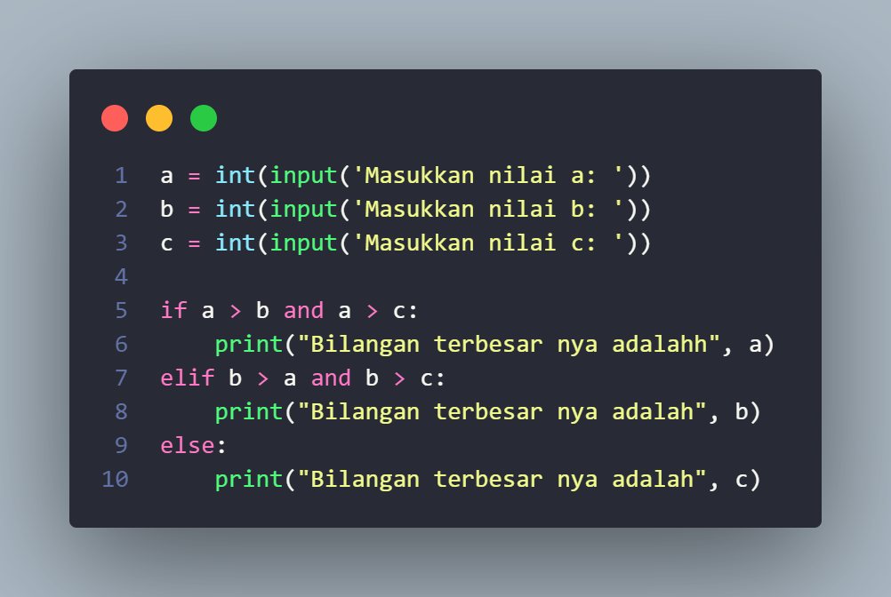
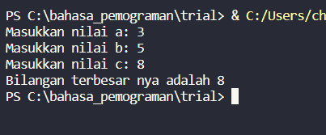
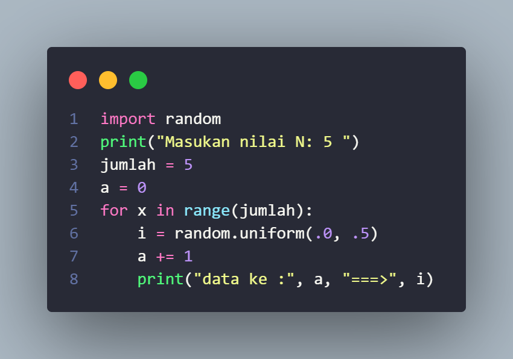
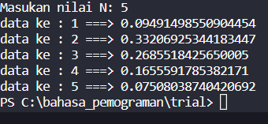
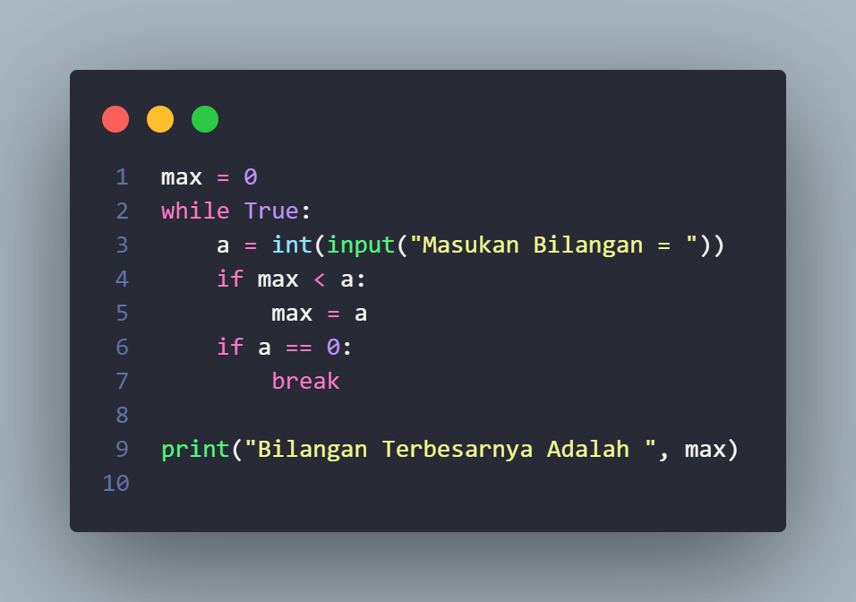
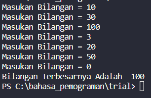
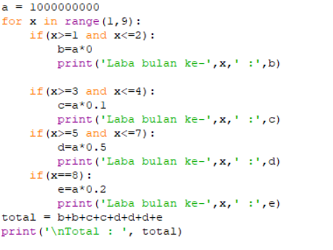
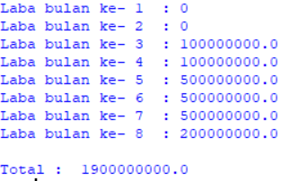

**Tugas Pratikum 2**
 
**1. Labpspy 02**

1. deklasrasikan variable dengan meminta user menginputkan nilaia nya
2. dengan code seperti ini
3. a = int(input('Masukkan nilai a: ')) 
b = int(input('Masukkan nilai b: ')) 
c = int(input('Masukkan nilai c: '))
4. kita buat pengkondisian
5. jika a > b dan a > c tampilkan nilai a
6. jika b > a dan b > c tampilkan nilai b
7. jika c > a dan c > b tampilkan nilai c
 
# Ini contoh input nya

 
 
# dan ini output nya 

Itu adalah program mencari bilangan terbesar dari 3 bilangan yang di input

___________________________________________________________________________
_____________________________________________________________________________

### **Pratikum 3**

## **Latihan 1.py**

1. kita bikin variable dengan nama (jumlah) yang mempunyai nilai 5
2. kita bikin variable ke 2 dengan nama (a) yang mempunyai nilai 0
3. kita mencari nilai dengan menggunkan (FOR)  
for x in range(jumlah): 
    i = random.uniform(.0, .5) 
    a += 1  
4. cetak nilai data i
5. print("data ke :", a, "===>", i)
6. sehingga codingan nya seperti ini

    

## dan OUTPUT nya nilai Random

Itulah cara mencari nilai bilangan random

--------------------------------------------------------------------------

### _latihan2.py_

Buat program untuk menampilkan bilangan terbesar dari n buah data yang diinputkan.
Masukkan angka 0 untuk berhenti

1. kita bikin variable dulu dengan nama variable (max) dengan nilai 0
2. kita bikin while yang bernilai true mengulang terus sampe ada nya break
3. kita bikin variable (a) dengan nilai inputan user
4. kita bikin pengkondisian
 if max < a:
        max = a
    if a == 0:
        break
5. print bilangan terbesar nya dari nilai (max)

## Input codinngan nya

## Output codingan nya

Itulah program untuk menampilkan bilangan terbesar dari n buah data yang diinputkan.

----------------------------------------------------------------------------------
-
------------------------------------------------------------------------------------
## **labpy03**
###  input 

### **Output**

Berikut penjelasan dari labpy03

masukkan nilai a

gunakan for untuk perulangan dari 1 sampai 8.Perulangan for disebut counted loop (perulangan yang terhitung)

lalu gunakan if pertama untuk menentukan laba bulan ke 1 dan ke 2.masukan variabel (b) kalikan nilai (a) dengan data bulan 1 dan 2. cetak (x) dan (b)

lalu gunakan if kedua untuk menentukan laba bulan ke 3 dan ke 4.masukan variabel (b) kalikan nilai (a) dengan data bulan 3 dan 4. cetak (x) dan (c)

lalu gunakan if ketiga untuk menentukan laba bulan ke 5 sampai ke 7.masukan variabel (b) kalikan nilai (a) dengan data bulan 5 sampai 7. cetak (x) dan (d)

lalu gunakan if keempat untuk menentukan laba bulan ke 8.masukan variabel (b) kalikan nilai (a) dengan data bulan 8. cetak (x) dan (e)

lalu total keseluruhan.

cetak total

